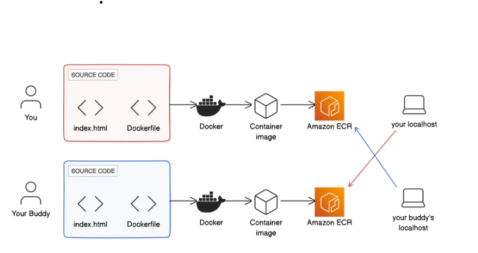

# Deploy an App Across AWS Accounts

This project involves deploying a Dockerized application across AWS accounts using **Amazon Elastic Container Registry (ECR)**. The project was developed as part of a multiplayer collaboration to securely store and share container images between accounts.

## Diagram repreentation



## Steps

- Build a Docker container image for a custom web app using `Dockerfile` and `index.html` files.
- Create a repository in **Amazon ECR** to store the container image.
- Create an IAM user with **AmazonEC2ContainerRegistryFullAccess** policy attached.
- Configure AWS CLI for authentication and access management.
- Push the image using the push commands in the repository. 
- Share the image across accounts by adding permission policies in ECR repository.

## Policy to add:

```
{
  "Version": "2012-10-17",
  "Statement": [
    {
      "Effect": "Allow",
      "Principal": {
        "AWS": "[player-b-ARN]"
      },
      "Action": [
        "ecr:BatchCheckLayerAvailability",
        "ecr:BatchGetImage",
        "ecr:GetDownloadUrlForLayer"
      ]
    }
  ]
}
```


## Connect with me 

**Kanika Mathur**  
- [E-mail](mkanika.90@gmail.com)
- [GitHub](https://github.com/KanikaGenesis)  
- [LinkedIn](https://www.linkedin.com/in/kanika-mathur-083080121)  


